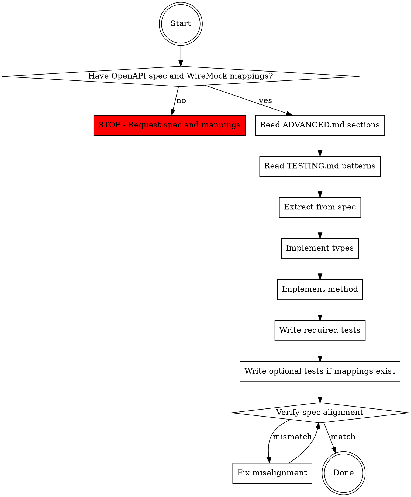

# Implement API Endpoint

## Overview

Disciplined workflow for implementing Smartsheet API endpoints in the JavaScript SDK. Ensures OpenAPI spec compliance, correct TypeScript patterns, and mandatory test coverage following TESTING.md requirements.

**Core principle:** OpenAPI spec is source of truth. Implementation and tests must match the spec exactly.

## When to Use

Use when:
- Adding a new API endpoint to the SDK
- Modifying an existing endpoint
- User requests endpoint implementation
- Updating endpoint for new API version

Do NOT use for:
- Bug fixes in existing endpoints (unless spec changed)
- Refactoring without behavior changes
- Documentation-only changes

## Prerequisites

**YOU MUST have BOTH before starting:**
1. **OpenAPI spec** - No implementation without spec
2. **WireMock mappings** - No tests without mappings

**Where to get OpenAPI spec:**
- Smartsheet Public API: https://developers.smartsheet.com/_spec/api/smartsheet/openapi.json
- User-provided spec file (for beta/unreleased endpoints)
- Extract from API documentation if absolutely necessary

**Where to get WireMock mappings:**
- smartsheet-sdk-tests repo: https://github.com/smartsheet/smartsheet-sdk-tests
- User-provided local mappings (ask for path)

**If either unavailable:** STOP. Ask user to provide both OpenAPI spec and WireMock mappings before proceeding.

## Implementation Workflow



## Step-by-Step Process

### 1. Validate Prerequisites

**Check OpenAPI spec availability:**
```bash
# If using public API spec
curl -s https://developers.smartsheet.com/_spec/api/smartsheet/openapi.json | jq '.paths' | grep -A 5 'endpoint-path'

# If user provided spec file
cat path/to/spec.json | jq '.paths."endpoint-path"'
```

**Check WireMock mappings availability:**
```bash
# If using smartsheet-sdk-tests repo (clone if needed)
git clone https://github.com/smartsheet/smartsheet-sdk-tests.git
ls smartsheet-sdk-tests/wiremock/<resource>/

# If user provided local mappings
ls path/to/mappings/<resource>/
```

**STOP if either missing.** Do not proceed without both OpenAPI spec and WireMock mappings.

### 2. Read Architecture Documentation

**Required reading from ADVANCED.md:**
- Resource Module Organization (line 254-286)
- Request Lifecycle (line 41-85)
- Response Handling (line 87-118)
- Serialization patterns (line 167-195)

**Key patterns to follow:**
- Factory function pattern: `create(options)` returns object with methods
- URL construction: Template literals with IDs
- TypeScript for new code, JavaScript for legacy
- requestor methods: `get()`, `post()`, `put()`, `delete()`

### 3. Read Testing Documentation

**Required reading from TESTING.md:**
- Standardized Test Cases (line 44-69)
- 4 required tests + 2 optional tests (conditional on WireMock mappings)
- Whole-object assertions with `.toEqual()`
- WireMock integration patterns (x-request-id, x-test-name headers)
- Helper functions: `createClient()`, `findWireMockRequest()` from `test/mock-api/utils/utils.ts`
- Enum usage requirement (line 104)
- **Gold standard examples:** `test/mock-api/reports/` (line 99) - USE AS TEMPLATE

### 4. Extract from OpenAPI Spec

**What to extract:**

| Spec Element | Used For |
|--------------|----------|
| `operationId` | Method name (camelCase) |
| `parameters` | Path params, query params, TypeScript types |
| `requestBody.schema` | Request body TypeScript interface |
| `responses.200.schema` | Response TypeScript interface |
| `required` arrays | Distinguish required vs optional properties |

**Example extraction:**
```typescript
// From spec: operationId: "getUserCustomAttributes"
// Path: /users/{userId}/customAttributes
// Parameters: userId (path, required), includeDeleted (query, optional)
// Response: { data: CustomAttribute[], totalCount?: number }
```

### 5. Implement TypeScript Types

**Location:** `lib/{apiGroup}/types.ts` (e.g., `lib/reports/types.ts`)

**MANDATORY:** All type definitions for new endpoints MUST be in `lib/{apiGroup}/types.ts`.

**What to add:**
1. Query parameters interface (if any query params)
2. Request body interface (for POST/PUT/PATCH)
3. Response interface
4. Options interface extending `RequestOptions`
5. Method signature in API interface (e.g., `ReportsApi`)
6. **If API interface exists:** Add interface to `SmartsheetClient` in `lib/types/SmartsheetClient.ts`

**Pattern (in `lib/users/types.ts`):**
```typescript
// Query parameters
export interface GetUserCustomAttributesQueryParameters {
  includeDeleted?: boolean;
}

// Response data model
export interface CustomAttribute {
  id: number;
  key: string;
  value: string;
  createdAt?: string;
  modifiedAt?: string;
}

// Response wrapper
export interface GetUserCustomAttributesResponse {
  data: CustomAttribute[];
  totalCount?: number;
}

// Options for the method
export interface GetUserCustomAttributesOptions 
  extends RequestOptions<GetUserCustomAttributesQueryParameters, undefined> {
  userId: number;
}

// Add to API interface for this resource
export interface UsersApi {
  // ... other methods
  getUserCustomAttributes(
    options: GetUserCustomAttributesOptions,
    callback?: RequestCallback<GetUserCustomAttributesResponse>
  ): Promise<GetUserCustomAttributesResponse>;
}
```

**Then in `lib/types/SmartsheetClient.ts`:**
```typescript
export interface SmartsheetClient {
  // ... other API groups
  users: UsersApi;  // Add if UsersApi interface exists
}
```

### 6. Implement Method

**Location:** `lib/<resource>/index.ts` (or `.js` for legacy modules)

**Pattern:**
```typescript
const getUserCustomAttributes = (
  getOptions: GetUserCustomAttributesOptions,
  callback?: RequestCallback<GetUserCustomAttributesResponse>
) => {
  const urlOptions = { url: buildGetUserCustomAttributesUrl(getOptions) };
  const requestOptions = { ...optionsToSend, ...urlOptions, ...getOptions };
  return requestor.get(requestOptions, callback);
};

const buildGetUserCustomAttributesUrl = (urlOptions: { userId: number }) =>
  options.apiUrls.users + '/' + urlOptions.userId + '/customAttributes';
```

**Export in returned object:**
```typescript
return {
  // ... other methods
  getUserCustomAttributes,
};
```

### 7. Write Required Tests (+ Optional if Mappings Exist)

**Location:** `test/mock-api/<resource>/<endpoint-name>.spec.ts`

**GOLD STANDARD TEMPLATE:** Use `test/mock-api/reports/` as your template for structure and patterns (TESTING.md line 99).

**4 REQUIRED tests (always implement):**

```typescript
describe('ResourceName - methodName endpoint tests', () => {
  it('methodName generated url is correct', async () => { 
    // Assert: method, URL path, query params ONLY
    // Query params MUST be asserted even if empty (use .toEqual({}))
    // Do NOT assert request/response body
  });
  
  it('methodName all response body properties', async () => { 
    // Assert: request body ALWAYS
    // - For POST/PUT/PATCH with body: assert the body object
    // - For GET/DELETE with no body: assert .toEqual('')
    // Assert: full response body
    // Do NOT assert method, URL, or query params
  });
  
  it('methodName error 400 response', async () => { /* ... */ });
  it('methodName error 500 response', async () => { /* ... */ });
});
```

**2 OPTIONAL tests (implement ONLY if WireMock mapping exists):**

```typescript
  it('methodName required response body properties', async () => {
    // Include ONLY if required-properties mapping exists in WireMock
    // Assert: request body ALWAYS (even if empty)
  });
  
  it('methodName [endpoint-specific behavior]', async () => {
    // For unique endpoint features: pagination, scope variants, etc.
  });
```

**Follow TESTING.md patterns exactly:**
- Use `createClient()` from `test/mock-api/utils/utils.ts`
- Use `crypto.randomUUID()` for request tracking
- Include `x-request-id` and `x-test-name` in `customProperties`
- Use `findWireMockRequest(requestId)` to retrieve request details
- Assert whole objects with `.toEqual()` (not property-by-property)
- Query params asserted as `Object.fromEntries(parsedUrl.searchParams)`
- **Use enums** (e.g., `ReportDestinationType.FOLDER`) not raw strings

### 8. Verify OpenAPI Spec Alignment

**Checklist:**

- [ ] Method name matches `operationId` (camelCase)
- [ ] URL path matches spec exactly
- [ ] All path parameters included
- [ ] All query parameters in TypeScript type
- [ ] Request body structure matches spec schema
- [ ] Response structure matches spec schema
- [ ] Required vs optional properties match spec
- [ ] All 4 required tests written
- [ ] Optional tests written ONLY if WireMock mappings exist
- [ ] Test assertions use whole-object `.toEqual()`
- [ ] Tests use enums, not raw string values
- [ ] Tests use `createClient()` and `findWireMockRequest()` helpers

**Manual verification commands:**
```bash
# Check types compile
npm run build

# Check tests exist and follow naming
ls test/mock-api/<resource>/ | grep <endpoint>

# Verify test patterns
grep "\.toEqual(" test/mock-api/<resource>/<endpoint>.spec.ts
```

## Common Mistakes

| Mistake | Fix |
|---------|-----|
| "Skipping spec validation (looks simple)" | ALWAYS verify against spec, even for simple endpoints |
| "Only writing 3-4 tests (others seem redundant)" | 4 required tests are MANDATORY per TESTING.md |
| "Writing optional tests without WireMock mappings" | Only write optional tests if mappings exist |
| "Types in wrong file or multiple files" | ALL types MUST be in `lib/{apiGroup}/types.ts` |
| "Forgot to add API interface to SmartsheetClient" | Add to `lib/types/SmartsheetClient.ts` if API interface exists |
| "Property-by-property assertions" | Use whole-object `.toEqual()` assertions |
| "Using raw strings instead of enums" | Use enum values (e.g., `ReportDestinationType.FOLDER`) |
| "Not using helper functions" | Use `createClient()` and `findWireMockRequest()` from utils.ts |
| "Guessing optional vs required" | Check `required` arrays in OpenAPI schema |
| "Not following Reports test patterns" | Use `test/mock-api/reports/` as template (TESTING.md line 99) |
| "Not reading ADVANCED.md patterns" | Read Resource Module Organization section |
| "Implementing without OpenAPI spec or mappings" | STOP - no implementation without both prerequisites |

## Red Flags - STOP and Verify

These thoughts mean you're about to skip something important:

- "This looks simple, I can skip the spec check"
- "3-4 tests should be enough"
- "I'll write the optional test anyway (no harm)"
- "I'll just copy from another endpoint (not Reports)"
- "Raw strings are fine, enums are overkill"
- "Optional vs required doesn't matter much"
- "Tests can come later"
- "User didn't provide spec/mappings, I'll use docs instead"
- "I don't need to look at Reports tests (I know the pattern)"

**All of these mean:** Go back to the checklist. Use Reports tests as template. Follow every step.

## Implementation Checklist

Use this checklist for every endpoint:

**Before writing code:**
- [ ] OpenAPI spec available and validated
- [ ] WireMock mappings available (from smartsheet-sdk-tests or user-provided)
- [ ] Verified which optional test mappings exist (required-properties, endpoint-specific)
- [ ] Read ADVANCED.md sections (Resource Module Organization, Request Lifecycle)
- [ ] Read TESTING.md (Standardized Test Cases)
- [ ] Extracted: operationId, path, parameters, request/response schemas
- [ ] Identified: required vs optional properties from spec

**TypeScript types (in `lib/{apiGroup}/types.ts`):**
- [ ] Query parameters interface (if applicable)
- [ ] Request body interface (if applicable)
- [ ] Response data interfaces
- [ ] Response wrapper interface
- [ ] Options interface extends RequestOptions
- [ ] Method signature added to API interface (e.g., ReportsApi)
- [ ] API interface added to SmartsheetClient (if API interface exists)

**Implementation:**
- [ ] Method implemented following factory pattern
- [ ] URL builder function created
- [ ] Uses correct requestor method (get/post/put/delete)
- [ ] Follows existing module patterns
- [ ] Method exported in returned object

**Tests:**
- [ ] Test file created in correct location
- [ ] Using `createClient()` from `test/mock-api/utils/utils.ts`
- [ ] Test 1: `<method> generated url is correct` (asserts method, URL, query params even if empty)
- [ ] Test 2: `<method> all response body properties` (asserts request body even if empty, response body)
- [ ] Test 3: `<method> error 400 response`
- [ ] Test 4: `<method> error 500 response`
- [ ] Test 5: `<method> required response body properties` (ONLY if WireMock mapping exists)
- [ ] Test 6: Endpoint-specific test (ONLY if applicable and mapping exists)
- [ ] All tests use `.toEqual()` with whole objects
- [ ] Tests use enums, not raw string values
- [ ] Request tracking with `x-request-id` and `findWireMockRequest()`

**Verification:**
- [ ] `npm run build` succeeds
- [ ] Manual spec alignment check completed
- [ ] All checklist items above verified

## The Iron Law

**NO IMPLEMENTATION WITHOUT OPENAPI SPEC AND WIREMOCK MAPPINGS.**

No exceptions. No guessing. No "I'll verify later."

The spec is the contract. Implementation must match the spec exactly. Tests require WireMock mappings to run.
