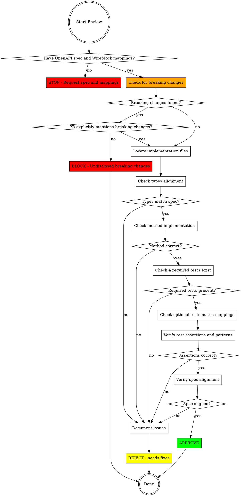

# Review API Endpoint

## Overview

Systematic code review process for API endpoint implementations in the Smartsheet JavaScript SDK. Verifies OpenAPI spec alignment, TypeScript correctness, test completeness, and pattern compliance.

**Core principle:** Verify, don't trust. Check every claim against spec and code.

## When to Use

Use when:
- Reviewing a pull request with endpoint changes
- Verifying endpoint implementation before merge
- Code review requested for API changes
- Quality check before release

Do NOT use for:
- Non-endpoint code reviews
- Documentation-only changes
- Simple bug fixes without spec changes

## Prerequisites

**YOU MUST have:**
1. OpenAPI spec for the endpoint being reviewed
2. WireMock mappings for the endpoint
3. Access to the implementation code
4. Access to the test files

**Where to get OpenAPI spec:**
- Smartsheet Public API: https://developers.smartsheet.com/_spec/api/smartsheet/openapi.json
- User-provided spec file
- PR description should link to spec

**Where to get WireMock mappings:**
- smartsheet-sdk-tests repo: https://github.com/smartsheet/smartsheet-sdk-tests
- User-provided local mappings (ask for path)
- PR description should specify mapping location

**If either missing:** STOP. Request both OpenAPI spec and WireMock mappings before proceeding with review.

## Review Workflow



## Review Checklist

### Phase 0: Breaking Changes Detection (CRITICAL - DO FIRST)

**⚠️ THIS IS THE MOST IMPORTANT PHASE. DO NOT SKIP.**

Breaking changes in a public SDK destroy client code. You MUST check for breaking changes BEFORE reviewing anything else.

**What is a breaking change?**

A breaking change is ANY modification that would cause existing client code to:
- Fail to compile
- Throw runtime errors
- Behave differently than before

**CRITICAL: If breaking changes exist and PR does NOT explicitly mention them, BLOCK immediately.**

#### Breaking Changes Checklist

Compare the PR's changes against the existing SDK contract:

**Modified Types (check lib/{apiGroup}/types.ts):**
- [ ] Any interface properties removed?
- [ ] Any required properties made optional? (remove `?`)
- [ ] Any optional properties made required? (add `?`)
- [ ] Any property types changed? (string → number, etc.)
- [ ] Any interface renamed or removed?
- [ ] Any enum values removed or changed?

**Modified Method Signatures (check API interfaces):**
- [ ] Any methods removed from API interface?
- [ ] Any method parameters added/removed/reordered?
- [ ] Any parameter types changed?
- [ ] Any return types changed?
- [ ] Any method renamed?

**How to check for breaking changes:**

```bash
# Compare current main branch with PR branch
git diff main..HEAD -- lib/{apiGroup}/types.ts

# Look for these patterns in the diff:
# - Lines removed from interfaces
# - `propertyName:` → `propertyName?:` (made optional)
# - `propertyName?:` → `propertyName:` (made required)
# - Type changes: `string` → `number`, `Type1` → `Type2`
# - Methods removed from API interface
```

**Decision tree:**

```
Found breaking changes?
├─ NO → Continue to Phase 1
└─ YES → Check PR description
    ├─ PR explicitly mentions breaking changes? (Look for keywords: "breaking change", "breaking", "major version", "⚠️")
    │   ├─ YES → Continue to Phase 1 (document breaking changes in review)
    │   └─ NO → **BLOCK IMMEDIATELY** - Undisclosed breaking changes
    └─ Not sure if it's breaking? → Ask yourself:
        "Would existing client code break if I deploy this?"
        If yes → It's breaking → BLOCK unless disclosed
```

**Common rationalizations to REJECT:**

| Rationalization | Reality | Counter-Argument |
|-----------------|---------|------------------|
| "The new code matches the OpenAPI spec perfectly" | Spec may have changed. SDK must maintain backward compatibility unless explicitly breaking. | The spec changing doesn't give us permission to break clients. BLOCK. |
| "Types compile, tests pass" | Existing CLIENT code won't compile. Client code isn't in this repo. | Our tests pass. Their code breaks. That's what breaking change means. BLOCK. |
| "Optional fields are backward compatible" | Making REQUIRED → optional breaks code that assumes presence. | Wrong direction. Optional → required breaks. Required → optional ALSO breaks because code assumes presence. BLOCK. |
| "It's an enhancement, not a break" | Adding = enhancement. Removing/changing = break. | If existing calls fail, it's breaking. Period. BLOCK. |
| "The spec changed, we're following it" | Spec changes don't justify breaking client code without disclosure. | We don't control client upgrade cycles. Can't force breaking changes on them silently. BLOCK. |
| "Minor change, shouldn't matter" | Size doesn't determine breaking. Impact on clients does. | One character change (`string` → `string?`) destroys production apps. BLOCK. |
| "Old pattern still works" | If signature changed, old calls fail. That's breaking. | "Still works" only applies to code in this repo. Client code breaks. BLOCK. |
| "We're aligning with the official spec" | Alignment doesn't justify breaking clients without disclosure. | Spec correctness ≠ backward compatibility. These are independent concerns. BLOCK. |
| "The spec was updated and we were out of sync" | Being out of sync doesn't mean breaking is acceptable. | Maybe the spec was wrong before, or we were wrong. Either way, clients depend on current behavior. BLOCK. |
| "All our tests pass" | Your tests aren't client code. | Tests in this repo test OUR code. Client code isn't here. BLOCK. |
| "It's just a type change" | Type changes break client code at compile time. | TypeScript clients won't compile. JavaScript clients get runtime errors. BLOCK. |
| "Technically backward compatible" | If client code breaks, it's not backward compatible. | "Technically" is a weasel word. Does client code break? Yes? Then BLOCK. |

**Examples of breaking changes:**

```typescript
// ❌ BREAKING: Required field made optional
interface User {
  id: number;
  email: string;
  firstName: string;  // Before: required
  firstName?: string; // After: optional - BREAKS code assuming it exists
}

// ❌ BREAKING: Parameter type changed
getUserCustomAttributes(options: {
  userId: number;  // Before
  userId: string;  // After - BREAKS code passing numbers
})

// ❌ BREAKING: Return type structure changed
// Before: Promise<CustomAttribute[]>
// After: Promise<{ data: CustomAttribute[]; totalCount: number }>
// BREAKS code expecting direct array access

// ❌ BREAKING: Method removed
interface UsersApi {
  listUsers(): Promise<User[]>;
  removeUser(options: { userId: number }): Promise<void>;  // Removed - BREAKS calls to this method
}

// ✅ NOT BREAKING: Adding new optional parameter
getUsers(options: { includeInactive?: boolean })  // New optional param is safe

// ✅ NOT BREAKING: Adding new method
getUserCustomAttributes(...)  // New method doesn't break existing code

// ✅ NOT BREAKING: Adding new optional property
interface User {
  id: number;
  customAttributes?: CustomAttribute[];  // New optional property is safe
}
```

**When in doubt:**
- If you think it MIGHT be breaking → It probably is → BLOCK unless disclosed
- Better to block incorrectly than approve breaking changes

**BLOCK means:**
- Do NOT continue review
- Do NOT check types alignment
- Do NOT check tests
- Immediately document breaking changes and request PR author acknowledge them

**Why you might resist blocking (and why you should anyway):**

You might feel:
- "The PR author did good work, I don't want to reject it"
- "The code is technically correct and matches the spec"
- "Blocking feels harsh for such a small change"
- "The spec changed, so this is justified"
- "All the tests pass, it seems fine"

**Reality:**
- Good implementation ≠ non-breaking. These are independent.
- Your job is protecting clients, not approving code.
- The size of the diff doesn't correlate with the size of the damage.
- Breaking client code in production is catastrophic.
- Better to block incorrectly 10 times than approve breaking changes once.

**Remember:** This is a PUBLIC SDK. Your approval ships code that thousands of client applications depend on. One undisclosed breaking change destroys production systems.

### Phase 1: Locate Files

**Find implementation:**
```bash
# TypeScript interface
grep -r "methodName" lib/<resource>/types.ts

# Implementation
grep -r "methodName" lib/<resource>/index.ts
grep -r "methodName" lib/<resource>/index.js

# Tests
find test/mock-api/<resource>/ -name "*method*.spec.ts"
```

**Required files:**
- [ ] TypeScript types file found
- [ ] Implementation file found
- [ ] Test file found

**If files missing:** Document as blocker. Cannot review without all files.

**Gold standard reference:** Compare structure and patterns to `test/mock-api/reports/` (TESTING.md line 99).

### Phase 2: TypeScript Types Review

**Check types file (`lib/{apiGroup}/types.ts` - e.g., `lib/reports/types.ts`):**

**CRITICAL:** All type definitions MUST be in `lib/{apiGroup}/types.ts`, not scattered across multiple files.

- [ ] Query parameters interface exists (if endpoint has query params)
- [ ] Request body interface exists (if POST/PUT/PATCH)
- [ ] Response data interfaces exist
- [ ] Response wrapper interface exists
- [ ] Options interface extends `RequestOptions<QueryParams, Body>`
- [ ] Method signature added to API interface (e.g., ReportsApi)
- [ ] Method has JSDoc documentation
- [ ] **If API interface exists:** Verify interface added to `SmartsheetClient` in `lib/types/SmartsheetClient.ts`

**Verification command:**
```bash
# Check if API interface is in SmartsheetClient
grep -r "ReportsApi" lib/types/SmartsheetClient.ts
```

**Spec alignment verification:**
```typescript
// From OpenAPI spec
parameters: [
  { name: "includeDeleted", in: "query", required: false, schema: { type: "boolean" } }
]

// Must match in code
export interface GetUserCustomAttributesQueryParameters {
  includeDeleted?: boolean;  // Optional = ? in TypeScript
}
```

**Common type issues:**

| Issue | How to Spot | Fix Required |
|-------|-------------|--------------|
| Missing optional marker (?) | Spec says required:false, code has no ? | Add ? to property |
| Wrong type | Spec says integer, code says string | Change type to match spec |
| Missing property | Spec has property, code doesn't | Add missing property |
| Extra property | Code has property, spec doesn't | Remove or verify spec |

### Phase 3: Implementation Review

**Check implementation file (lib/<resource>/index.ts):**

- [ ] Method implemented with correct signature
- [ ] URL builder function exists
- [ ] URL path matches OpenAPI spec exactly
- [ ] Uses correct HTTP verb (GET/POST/PUT/DELETE)
- [ ] Follows factory pattern
- [ ] Options merged correctly: `{ ...optionsToSend, ...urlOptions, ...getOptions }`
- [ ] Returns `requestor.<method>(options, callback)`
- [ ] Method exported in returned object

**URL path verification:**
```typescript
// OpenAPI spec: /users/{userId}/customAttributes
// Implementation must match
const buildUrl = (opts: { userId: number }) =>
  options.apiUrls.users + '/' + opts.userId + '/customAttributes';
```

**HTTP verb mapping:**
| OpenAPI Method | requestor Method |
|----------------|------------------|
| GET | requestor.get() |
| POST | requestor.post() |
| PUT | requestor.put() |
| DELETE | requestor.delete() |

### Phase 4: Test Coverage Review

**Check test file (test/mock-api/<resource>/<method>.spec.ts):**

**Reference:** See `test/mock-api/reports/` for gold standard test examples per TESTING.md.

**4 REQUIRED TESTS (must be present):**

- [ ] Test 1: `<method> generated url is correct`
  - Verifies URL path construction
  - Verifies query parameters (MUST assert even if empty - use `.toEqual({})`)
  - Uses `findWireMockRequest(requestId)` from `test/mock-api/utils/utils.ts`
  - Asserts pathname with `.toEqual()`
  - Asserts query params as whole object
  - **Does NOT assert request/response body**

- [ ] Test 2: `<method> all response body properties`
  - Tests complete response with ALL optional properties
  - Uses whole-object `.toEqual()` assertion
  - Includes all fields from OpenAPI response schema
  - MUST assert request body ALWAYS (for POST/PUT/PATCH with body: assert body object; for GET/DELETE: assert `.toEqual('')`)
  - **Does NOT assert method, URL, or query params**

- [ ] Test 3: `<method> error 400 response`
  - Tests client error handling
  - Uses `x-test-name: '/errors/400-response'`
  - Asserts `error.statusCode === 400`
  - Asserts `error.message`

- [ ] Test 4: `<method> error 500 response`
  - Tests server error handling
  - Uses `x-test-name: '/errors/500-response'`
  - Asserts `error.statusCode === 500`
  - Asserts `error.message`

**2 OPTIONAL TESTS (conditional):**

- [ ] Test 5: `<method> required response body properties` (ONLY if WireMock mapping exists)
  - Tests minimal response with ONLY required properties
  - Uses whole-object `.toEqual()` assertion
  - Only includes fields marked `required: true` in spec
  - MUST assert request body ALWAYS (even if empty)
  - **BLOCK PR if test exists WITHOUT corresponding WireMock mapping**

- [ ] Test 6: Endpoint-specific test (if applicable and mapping exists)
  - Tests unique endpoint behavior
  - Examples: pagination, scope variants, role differences

**Additional verification:**

- [ ] Tests use `createClient()` from `test/mock-api/utils/utils.ts`
- [ ] Tests use enums (e.g., `ReportDestinationType.FOLDER`), NOT raw strings
- [ ] Each test's `x-test-name` matches an actual WireMock mapping
- [ ] WireMock integration: `x-request-id` and `x-test-name` in `customProperties`

**Test pattern verification:**
```typescript
// ✅ CORRECT - Whole object assertion
expect(response).toEqual({
  data: [...],
  totalCount: 2
});

// ❌ INCORRECT - Property-by-property
expect(response.data.length).toBe(2);
expect(response.totalCount).toBe(2);

// ✅ CORRECT - Query params as object
const queryParamsObject = Object.fromEntries(parsedUrl.searchParams);
expect(queryParamsObject).toEqual({ includeDeleted: 'true' });

// ❌ INCORRECT - Individual param checks
expect(parsedUrl.searchParams.get('includeDeleted')).toBe('true');

// ✅ CORRECT - Using enums
expect(report.destination.type).toEqual(ReportDestinationType.FOLDER);

// ❌ INCORRECT - Raw strings
expect(report.destination.type).toEqual('FOLDER');
```

**Verify WireMock mapping alignment:**
```bash
# Check available mappings for the resource
ls smartsheet-sdk-tests/wiremock/<resource>/

# Or if user-provided
ls path/to/mappings/<resource>/

# Verify test's x-test-name matches a mapping file
grep "x-test-name" test/mock-api/<resource>/<method>.spec.ts
```

### Phase 5: Spec Alignment Deep Dive

**Critical verification - DO NOT SKIP:**

**1. Request Parameters Alignment:**

Extract from spec:
```bash
curl -s https://developers.smartsheet.com/_spec/api/smartsheet/openapi.json | \
  jq '.paths."/users/{userId}/customAttributes".get.parameters'
```

Compare with TypeScript interface:
- Each parameter must exist
- Types must match (integer → number, boolean → boolean, string → string)
- Required vs optional must match (required: false → `?` in TypeScript)

**2. Response Schema Alignment:**

Extract from spec:
```bash
curl -s https://developers.smartsheet.com/_spec/api/smartsheet/openapi.json | \
  jq '.paths."/users/{userId}/customAttributes".get.responses."200".content."application/json".schema'
```

Compare with TypeScript interface:
- All properties exist
- Nested structures match
- Arrays typed correctly
- Required properties marked in interface

**3. Test Response Alignment:**

Check test file's `all_response_properties` test:
- Must include ALL properties from spec (required + optional)
- Property types must match spec types
- Nested structures must match spec nesting

Check test file's `required_response_properties` test:
- Must include ONLY properties marked `required: true` in spec
- No optional properties present

## Review Decision Matrix

**Priority order:** Breaking changes are checked FIRST, before all other issues.

| Category | Status | Action |
|----------|--------|--------|
| **Breaking changes without disclosure** | 🚨 **BLOCK IMMEDIATELY** | **Stop review. Document breaking changes. Request PR author explicitly acknowledge them. Do NOT continue review.** |
| Missing OpenAPI spec | 🛑 BLOCK | Request spec before review |
| Missing WireMock mappings | 🛑 BLOCK | Request mappings before review |
| Breaking changes WITH disclosure | ⚠️ DOCUMENT | Note in review, continue review, approve only if everything else passes |
| Missing test file | 🛑 BLOCK | Request tests |
| Types not in `lib/{apiGroup}/types.ts` | 🛑 BLOCK | Move all types to correct file |
| API interface not in SmartsheetClient | 🛑 BLOCK | Add to `lib/types/SmartsheetClient.ts` |
| < 4 required tests | 🛑 BLOCK | Request missing required tests |
| Optional test WITHOUT WireMock mapping | 🛑 BLOCK | Remove test or provide mapping |
| Test x-test-name references non-existent mapping | 🛑 BLOCK | Fix x-test-name or add mapping |
| Type mismatch with spec | 🛑 BLOCK | Fix types to match spec |
| URL path wrong | 🛑 BLOCK | Fix URL to match spec |
| Wrong HTTP verb | 🛑 BLOCK | Fix verb to match spec |
| Property-by-property assertions | ⚠️ REQUEST CHANGES | Change to `.toEqual()` |
| Raw strings instead of enums | ⚠️ REQUEST CHANGES | Use enum values |
| Not using helper functions (createClient, findWireMockRequest) | ⚠️ REQUEST CHANGES | Use helpers from utils.ts |
| Missing optional test when WireMock mapping exists | ⚠️ REQUEST CHANGES | Add optional test |
| Missing optional marker (?) | ⚠️ REQUEST CHANGES | Add ? to optional properties |
| Poor test names | ⚠️ REQUEST CHANGES | Follow TESTING.md naming convention |
| Missing JSDoc | 💬 COMMENT | Add documentation |
| Minor style issues | 💬 COMMENT | Nitpick |

## Common Review Failures

### Failure 0: Not Checking for Breaking Changes (MOST CRITICAL)

**Symptom:** "Code matches spec, tests pass, approved"

**Problem:** Didn't check if changes break existing client code

**Impact:** CATASTROPHIC - Deploys SDK update that breaks all client applications

**Fix:** 
1. ALWAYS run `git diff main..HEAD -- lib/{apiGroup}/types.ts` FIRST
2. Check every interface modification for breaking changes
3. Check API interface for removed/modified methods
4. BLOCK immediately if breaking changes found without disclosure

**Red flags you're about to make this mistake:**
- "Everything looks good, the new code works"
- "Types compile successfully"
- "Tests are passing"
- "Follows patterns from other endpoints"
- **None of these check backward compatibility with EXISTING client code**

### Failure 1: Superficial Review

**Symptom:** "Looks good, tests pass, approved"

**Problem:** Didn't verify spec alignment

**Fix:** Actually compare implementation to OpenAPI spec. Line by line.

### Failure 2: Trusting Test Names

**Symptom:** "I see all required tests exist, approved"

**Problem:** Didn't check test content

**Fix:** Read each test. Verify assertions use `.toEqual()` with whole objects.

### Failure 3: Skipping Type Verification

**Symptom:** "Types compile, approved"

**Problem:** TypeScript types don't match OpenAPI spec

**Fix:** Compare TypeScript interface to spec schema. Check every property.

### Failure 4: Not Verifying WireMock Mappings

**Symptom:** "Tests look fine, approved"

**Problem:** Optional tests exist without WireMock mappings, or x-test-name references non-existent mappings

**Fix:** List available mappings. Verify each test's x-test-name matches a mapping file.

### Failure 5: Missing Enum Usage Check

**Symptom:** "Tests assert values correctly, approved"

**Problem:** Tests use raw strings ('FOLDER') instead of enums (ReportDestinationType.FOLDER)

**Fix:** Search for raw string literals in test assertions. Request enum usage.

### Failure 6: Not Checking Helper Functions

**Symptom:** "Tests create client and retrieve requests, approved"

**Problem:** Tests inline client creation or request retrieval instead of using utils.ts helpers

**Fix:** Verify tests use `createClient()` and `findWireMockRequest()` from utils.ts.

### Failure 7: Not Verifying Type File Location

**Symptom:** "Types look good, approved"

**Problem:** Types scattered across multiple files instead of in `lib/{apiGroup}/types.ts`

**Fix:** Verify all types are in the correct single file: `lib/{apiGroup}/types.ts`.

### Failure 8: Missing SmartsheetClient Update

**Symptom:** "API interface defined, approved"

**Problem:** Forgot to check if API interface added to SmartsheetClient

**Fix:** Verify API interface is in `lib/types/SmartsheetClient.ts` if the interface exists.

### Failure 9: Rubber-Stamp Approval

**Symptom:** "Implementation follows patterns, approved"

**Problem:** Didn't verify against spec

**Fix:** Go through full checklist. Verify every item.

## Red Flags During Review

These observations mean you need to investigate further:

**⚠️ CRITICAL - Breaking Changes Red Flags:**
- "The new code matches the spec perfectly"
- "Types compile, tests pass"
- "Everything works in the new implementation"
- "It's backward compatible" (without actually checking)
- "Just following the updated spec"
- "Minor type change"
- "Adding optional field" (check if it was REQUIRED before)
- NOT running `git diff` to compare against main branch

**All of these ignore the question: "Does existing CLIENT code still work?"**

**Other Red Flags:**
- "Only 3-5 tests (seems like enough)"
- "Optional test looks good (didn't check if mapping exists)"
- "Types look reasonable"
- "Pattern matches other endpoints"
- "Tests are passing"
- "Implementation looks clean"
- "String values match (didn't check for enum usage)"
- "Client creation works (didn't verify helper usage)"

**None of these substitute for spec verification and TESTING.md compliance.**

## Review Output Format

Structure your review feedback clearly:

```markdown
## Review: [Endpoint Name]

### Phase 0: Breaking Changes (CRITICAL)
- [ ] Checked for breaking changes: [pass/fail]
- [ ] Breaking changes found: [yes/no]
- [ ] If yes, PR explicitly mentions breaking changes: [yes/no/n/a]

**Breaking changes details:**
[List any breaking changes found, or "None" if no breaking changes]

**If breaking changes found without disclosure: STOP HERE - BLOCK IMMEDIATELY**

### Prerequisites
- [ ] OpenAPI spec provided: [link or path]
- [ ] WireMock mappings available: [link or path]
- [ ] Spec validated
- [ ] Available mappings verified

### TypeScript Types (MUST be in `lib/{apiGroup}/types.ts`)
- [ ] All types in correct file (`lib/{apiGroup}/types.ts`): [pass/fail]
- [ ] Query parameters interface: [pass/fail]
- [ ] Request body interface: [pass/fail/n/a]
- [ ] Response interfaces: [pass/fail]
- [ ] Method signature in API interface: [pass/fail]
- [ ] API interface added to SmartsheetClient: [pass/fail/n/a - interface exists: yes/no]

Issues:
- [Specific issue with line number]

### Implementation
- [ ] URL path correct: [pass/fail]
- [ ] HTTP verb correct: [pass/fail]
- [ ] Pattern compliance: [pass/fail]

Issues:
- [Specific issue with line number]

### Test Coverage (REQUIRED: 4 tests)
- [ ] Test 1 (generated url is correct): [pass/fail]
- [ ] Test 2 (all response body properties): [pass/fail]
- [ ] Test 3 (error 400 response): [pass/fail]
- [ ] Test 4 (error 500 response): [pass/fail]

### Test Coverage (OPTIONAL: conditional on mappings)
- [ ] Test 5 (required response body properties): [pass/fail/n/a - mapping exists: yes/no]
- [ ] Test 6 (endpoint-specific): [pass/fail/n/a - mapping exists: yes/no]

### Test Quality
- [ ] Using createClient() from utils.ts: [pass/fail]
- [ ] Using findWireMockRequest() from utils.ts: [pass/fail]
- [ ] Whole-object assertions (.toEqual()): [pass/fail]
- [ ] Using enums (not raw strings): [pass/fail]
- [ ] x-test-name matches WireMock mappings: [pass/fail]
- [ ] Test naming follows TESTING.md convention: [pass/fail]

Issues:
- [Specific issue with line number]

### Spec Alignment
- [ ] Request parameters match spec: [pass/fail]
- [ ] Response schema matches spec: [pass/fail]
- [ ] Required vs optional correct: [pass/fail]

Issues:
- [Specific misalignment with spec reference]

### Decision
**[APPROVE / REQUEST CHANGES / BLOCK]**

Rationale: [Brief explanation]

**Reference:** Compare implementation against gold standard in `test/mock-api/reports/`
```

## The Iron Law

**NO APPROVAL WITHOUT BREAKING CHANGES CHECK, SPEC VERIFICATION, AND WIREMOCK VERIFICATION.**

If you didn't check for breaking changes AND compare the implementation to the OpenAPI spec line by line AND verify WireMock mappings, you didn't review it.

Verification means:
1. **CHECKED FOR BREAKING CHANGES FIRST** (run `git diff main..HEAD`)
2. **IF BREAKING CHANGES FOUND:** Verified PR explicitly mentions them, or BLOCKED
3. Opened the OpenAPI spec
4. Found the endpoint
5. Compared parameters (every one)
6. Compared request schema (every property)
7. Compared response schema (every property)
8. Verified tests match schema
9. Listed available WireMock mappings
10. Verified each test's x-test-name matches a mapping
11. Verified optional tests only exist when mappings exist
12. Verified enum usage (not raw strings)
13. Verified helper function usage (createClient, findWireMockRequest)

Anything less is a rubber-stamp, not a review.

**Breaking changes check is NON-NEGOTIABLE. This is a PUBLIC SDK. Breaking client code is catastrophic.**

**Gold standard reference:** `test/mock-api/reports/` per TESTING.md line 99.
